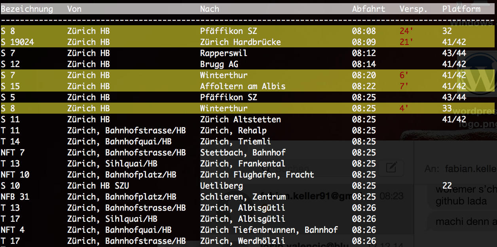
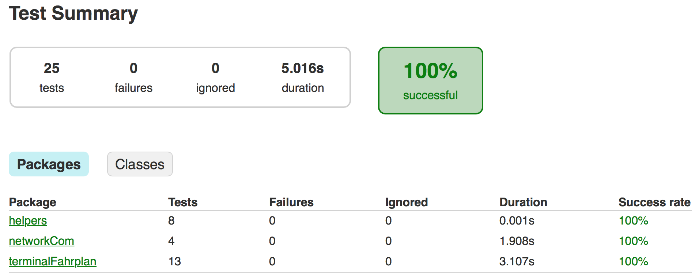

# TerminalFahrplan
## Idea
The idea is to have a Terminal Application which shows the timeline of a chosen public transport station. It will refresh every ***X*** seconds so you have an always up-to-date view of the outgoing and incoming public transport in your area.  
The service will be limited to switzerland only. Reason for that is the [chosen API](http://transport.opendata.ch "Swiss public transport API").
## Current State
State: **In Progress** (about 85% finished)  


## Install
```
./gradlew installApp
```
## Run
### Option 1: Development Purpose (Offline Mode)
**Run without any parameters**

```
build/install/TerminalFahrplan/bin/TerminalFahrplan
```	
**What it does?**  

* Shows Stationboard from offline File (zuerichHB.json)

### Option 2: Stationboard View (with Auto-Update)
**Run with 1 Parameter (example: Rapperswil)**

```
build/install/TerminalFahrplan/bin/TerminalFahrplan Zürich HB
```	
### Option 3: From/To (Under development...)  
		
## Edit project (Eclipse)

**Generate Eclipse project files:**

```
./gradlew eclipse
```
**[Install Lombok](http://projectlombok.org "Lombok")**  
(Needed so Eclipse won't show any compile Errors)

## Testing
**Run Test Cases:**

```
./gradlew test
```
`NOTE: You need a working internet connection for all tests to succeed because the API connectivity is also tested.`  

**View Test Results:**  
To see the Test Report, open "build/reports/tests/index.html" with a browser of your choice.

**Example:**


## Known issues
- What happens when loosing connection while looking up station name? ;)
- From/To not implemented yet ;)

## Used Technology
Coding language: **Java**  
API format:	**JSON**  
Build Tool: **Gradle**
## Main Goal
Main goal is to create an Android Service Only Application which sends you push notifications when your train/bus/etc. is too late.  
This project is more of a small test to get into working with API's.


