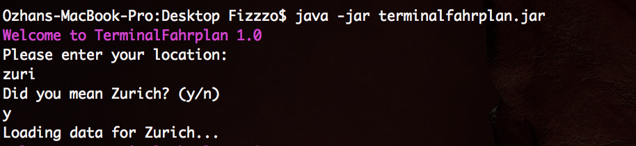
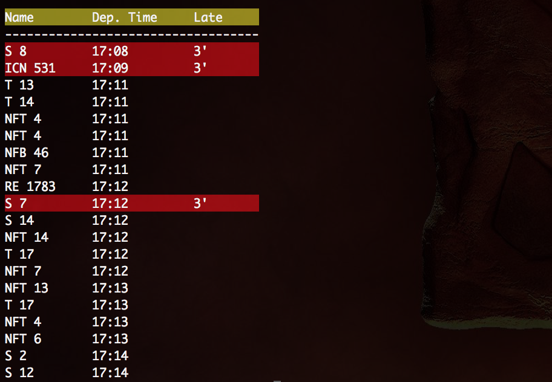

# TerminalFahrplan
## Idea
The idea is to have a Terminal Application which shows the timeline of a chosen public transport station. It will refresh every ***X*** seconds so you have an always up-to-date view of the outgoing and incoming public transport in your area.  
The service will be limited to switzerland only. Reason for that is the [chosen API](http://transport.opendata.ch "Swiss public transport API").
## Current State
State: **In Progress** (about 20% finished)
## How it works
1. You are prompted to enter your station.  
Enter **zuri** for example and press **y**  

2. Done! Your View of the timing table will be refreshed every ***X*** seconds.  
  

## How to setup
1. Open a Terminal and locate to the project path
2. Run following Command:  
`javac -cp "java-json.jar" src/TerminalFahrplan/Main.java`
3. ***Coming soon...***

## Used Technology
Coding language: **Java**  
API format:	**JSON**
## Main Goal
Main goal is to create an Android Service Only Application which sends you push notifications when your train/bus/etc. is too late.  
This project is more of a small test to get into working with API's.